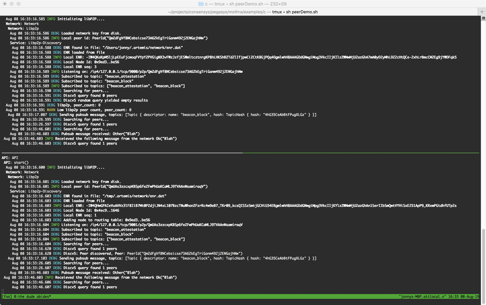

# Mothra: LibP2P for Dummies

> Credits: This project borrows heavily from: https://github.com/sigp/lighthouse

Mothra was created to house native language bindings between [Rust-LibP2P](https://github.com/libp2p/rust-libp2p) and any number of other languages.  The current languages that are supported are:

- C
- Java

### The Thing That Should Not Be


  
Mothra is wire protocol agnostic and intended to provide a simple API that requires no previous knowledge of libP2P.  The API consists of:

- Basic network configuration settings 
  - ip addresses
  - ports
  - logging
  - etc
- PubSub
  - event subscription
  - send/receive
- RPC
  - send/receive


### Prereqs

On OSX:

Install rustup so you can switch between Rust versions:

```sh

> brew install rustup

```

Install the Rust compiler and package manager:

```sh

> rustup-init

```

`tmux` is the last prereq, but it is optional.  Installing it will make running the demo easier:

```sh

> brew install tmux

```


### Build Mothra

Building is easy.  First, clone the repo:

```sh

> git clone git@github.com:jrhea/mothra.git

```

#### Build for C

Next cd into the project's root dir and build:

```sh

> make c

```

#### Build for Java

Next cd into the project's root dir and build:

```sh

> make java

```

### Sample App

Here is a screenshot of the sample app in action:




#### Run Sample App (C)

The sample app demonstrates two clients using Disv5 to find each other and the use of GossipSub to send messages back and forth.

If you have `tmux` installed, it is a little simpler to run:

```sh

> cd examples/c && sh peerDemo.sh

```

If you don't have `tmux` installed and don't want to, then as long as you have followed all the instructions above, then it should work.  

In one terminal run:

```sh

> ./bin/example

```

In a second terminal run:

```sh

> ./example --boot-nodes -IW4QKaKpM5ljLpEEuFjcmoqFVYpY2PVGigNX3vFWzJzfjESWmltcztnrgKP8hLHKShBZTd2lIfjpwCiZCtK8GjPQq4DgmlwhH8AAAGDdGNwgiMog3VkcIIjKIlzZWNwMjU2azGhA7mA0yD2yMhLDZ2cHtQCe-2xhLrBmcCM2Eg9jYWDFqk5 --listen-address 127.0.0.1 --port 9001 --datadir /tmp/.artemis

```

#### Run Sample App (Java)

The sample app demonstrates two clients using Disv5 to find each other and the use of GossipSub to send messages back and forth.

If you have `tmux` installed, it is a little simpler to run:

```sh

> cd examples/java && sh peerDemo.sh

```
